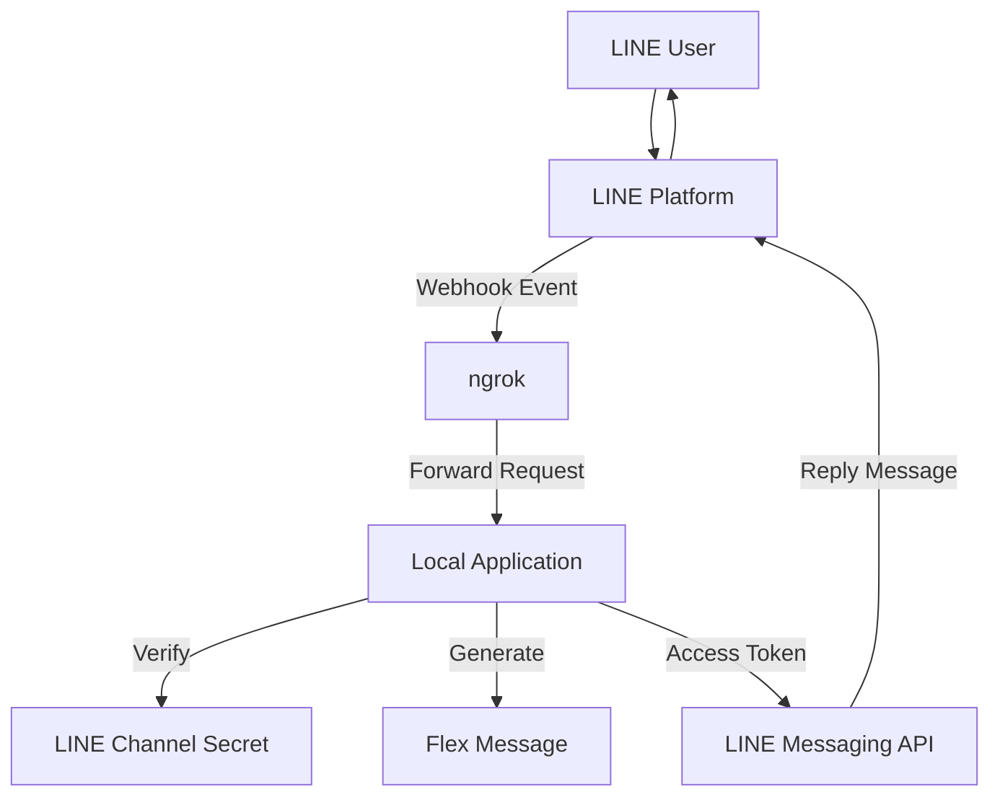

# Examples

|                Telemed Start                |                     More Info                    |                     About Us                     |                    Health Tip                    |
| :----------------------------------------------: | :----------------------------------------------: | :----------------------------------------------: | :----------------------------------------------: |
|  |  |  |  |
|    [JSON](./telemedicine-start.json)   |  [JSON](./telemedicine-info.json)  |         [JSON](./about.json)        |       [JSON](./health-tips.json)       |

|               Doctor Schedule               |                     Announcements                    |
| :----------------------------------------------: | :----------------------------------------------: |
|  |  |
| [JSON](./thai-schedule.json) | [JSON](./announcements.json) |

## Architecture

